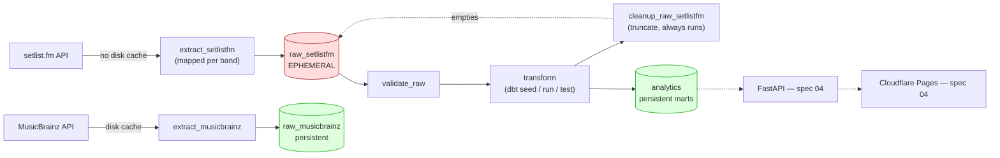

# Encore

Non-commercial data portfolio project measuring how bands use their own
catalog in live shows over their careers — repertoire age, rotation
between shows, and how long a song survives in the setlist after
release. See [docs/encore-projeto.md](docs/encore-projeto.md) for the
full project brief (questions answered, KPIs, band scope) and
[docs/context/](docs/context/) for the product/tech/structure context
used to drive implementation.

> This README grows spec by spec. Everything below reflects what
> **spec-01** (infrastructure and ingestion) has built; dbt models, KPIs
> and the API/frontend are later specs. See
> [docs/specs/spec-01-progress.md](docs/specs/spec-01-progress.md) for
> the detailed, task-by-task build log — including bugs found and fixed
> along the way.

## Architecture



Solid arrows are built (specs 01 and 02a); dashed arrows are later specs. The
`encore_pipeline` DAG (`airflow/dags/encore_pipeline.py`) runs monthly:
`truncate_raw_setlistfm_start → check_api_budget → extract_musicbrainz →
extract_setlistfm → validate_raw → transform → cleanup_raw_setlistfm →
log_run`, with `cleanup_raw_setlistfm` and `log_run` set to
`trigger_rule=all_done` so raw setlist.fm data is deleted (and the run
is logged) even when an earlier task fails. A separate daily DAG,
`airflow/dags/log_cleanup.py`, removes Airflow's own log files older
than 14 days.

## Data policy

Non-negotiable, from [docs/context/product.md](docs/context/product.md):

- **setlist.fm data is ephemeral.** Raw responses go straight into
  `raw_setlistfm` (no disk cache) and exist only for the duration of a
  pipeline run — `cleanup_raw_setlistfm` truncates every table in that
  schema at the end, even if the run failed. The repository, including
  notebook outputs, never contains setlist.fm data.
- **Only aggregated results are persisted and published** — by band,
  tour, album and song. Nothing under `analytics` may contain per-show
  or per-setlist rows derived from setlist.fm; a dedicated guard test
  (`tests/integration/test_analytics_schema_guard.py`) fails the build
  if any table there ever gets a `setlist_id` column.
- **No per-show setlist pages.** When a show is referenced anywhere
  public (once the frontend exists, spec 04), it links to that show's
  own page on setlist.fm rather than reproducing its content.
- **setlist.fm attribution is mandatory** on every page that uses its
  data: a visible link to the setlist.fm page for that data (or to
  setlist.fm's home page), without `nofollow`, present in the rendered
  HTML so it's crawlable — not just in a footer buried behind
  JavaScript. This has no concrete implementation yet (there's no
  frontend until spec 04), but the requirement is fixed now so it isn't
  an afterthought later.
- **MusicBrainz data (CC0) can be persisted normally** — it's the only
  reason `raw_musicbrainz` is allowed to survive between runs while
  `raw_setlistfm` isn't.
- **The setlist.fm API key is never committed or shared** — only in
  `.env` (gitignored), never in code, docs, or logs.

## Running locally

```bash
cp .env.example .env   # fill in real values, see comments in the file
make up
```

`make up`/`down`/`ps`/`logs` (see the [Makefile](Makefile)) exist
because Docker Compose resolves the `${VAR}` placeholders in
`infra/docker-compose.yml` (including the required-variable checks)
against a `.env` file in the compose file's own directory (`infra/`) by
default, not against the repo root where this project's `.env` actually
lives. Without an explicit `--env-file .env`, a bare `docker compose up`
fails immediately with "variable is missing a value" even though `.env`
exists one level up — the Makefile targets pass it consistently so
nobody has to remember or retype the full invocation:

```bash
make ps
make logs   # follow every service's logs; Ctrl-C to stop following
make down
```

Two more targets exist for working on the dbt project. `make build`
rebuilds the Airflow image (it bakes the current `dbt/` and its commit
hash, logged at the start of every transform run). `make up-dev` starts
the stack like `make up` but also bind-mounts `./dbt` read-only into the
Airflow containers ([`infra/docker-compose.dev.yml`](infra/docker-compose.dev.yml)),
so dbt changes take effect without a rebuild. **Local development only:**
on the VM use `make up` (the image's copy of `dbt/` is what runs there).

Anything beyond these (e.g. `--build`, `--profile test`, targeting
a single service) still needs the full command — see "Deploying to the
VM" and "Integration tests" below for examples.

Once the stack is up, the Airflow UI is at http://localhost:8080
(`AIRFLOW_WWW_USER_USERNAME`/`AIRFLOW_WWW_USER_PASSWORD` from `.env`).
To limit a run to a subset of bands (useful for a smoke test, and how
the first real run against production APIs was done — see
`docs/specs/spec-01-progress.md` item 25), set `ENCORE_BANDS_FILTER` in
`.env` to a comma-separated list of band names matching
`config/bands.yaml` exactly, e.g. `ENCORE_BANDS_FILTER=Muse`.

## Database schema bootstrap

The shared PostgreSQL instance holds two databases: `airflow` (Airflow's
own metadata) and `encore` (this project's data). Inside `encore`, six
schemas exist: `raw_setlistfm`, `raw_musicbrainz`, `staging`,
`intermediate`, `analytics`, `ops` (see
[docs/context/structure.md](docs/context/structure.md) for what each one
holds).

Schema creation is idempotent (`CREATE SCHEMA IF NOT EXISTS`) and runs in
two ways:

1. **Automatically on first boot**, via
   [infra/postgres/init/](infra/postgres/init/) — these scripts only run
   when the `postgres-db-volume` is empty (standard Postgres image
   behavior), so they never touch an already-initialized database.
2. **On demand, against any existing database** — for example after
   restoring a volume that predates a schema, or if you ever need to
   re-run it manually:

   ```bash
   python -m encore.db
   ```

   This requires `POSTGRES_USER`, `POSTGRES_PASSWORD` and, outside the
   `airflow-*` containers, `POSTGRES_HOST`/`POSTGRES_PORT` pointing at the
   exposed port (`127.0.0.1:5435` locally) — see
   [.env.example](.env.example). From the host (not inside a container),
   also set `PYTHONPATH=src` so `python -m encore.db` can find the
   package:

   ```bash
   PYTHONPATH=src POSTGRES_HOST=localhost POSTGRES_PORT=5435 python -m encore.db
   ```

   Safe to run repeatedly — verified against a real PostgreSQL container:
   running it a second time against the schemas created by
   `infra/postgres/init/` on first boot produces no errors.

## Tests

```bash
pytest                              # fast unit suite: mocked HTTP + mocked DB, no Docker
PYTHONPATH=src python -m pytest tests/integration -v   # real Postgres, see below
```

### Integration tests

Unit tests (`pytest`, no arguments) run against mocked HTTP and mocked
DB connections — no Docker required. `tests/integration/` instead runs
the same ingestion/ops code against a **real** PostgreSQL, to catch bugs
mocks can't (wrong SQL syntax, a broken foreign key, an upsert that
doesn't actually dedupe). It's excluded from the default `pytest` run
(see `pytest.ini`'s `norecursedirs`), so it needs to be invoked
explicitly, and it needs `postgres-test` running first:

```bash
docker compose -f infra/docker-compose.yml --env-file .env --profile test up -d postgres-test
PYTHONPATH=src python -m pytest tests/integration -v
docker compose -f infra/docker-compose.yml --env-file .env --profile test down
```

If `postgres-test` isn't running, every test in `tests/integration/`
skips (rather than erroring) — the connection attempt happens once per
session, so a skip run finishes in a few seconds, not minutes.

## Deploying to the VM

Per [docs/context/tech.md](docs/context/tech.md): an Oracle Cloud VM
(ARM64/aarch64, Ubuntu 24.04) with Docker installed, project directory
`/opt/encore`. Deployment is manual for spec-01 (automation is a later
spec) — the reference sequence:

```bash
# On the VM, as the deploy user
sudo mkdir -p /opt/encore && sudo chown "$USER" /opt/encore
git clone <this repo> /opt/encore
cd /opt/encore
cp .env.example .env
# Fill in real values in .env — a real POSTGRES_PASSWORD, generated
# AIRFLOW_FERNET_KEY/AIRFLOW_JWT_SECRET, the setlist.fm API key, etc.
# (see .env.example's comments for how to generate each secret).
nano .env

docker compose -f infra/docker-compose.yml --env-file .env up -d --build
```

`--build` (not covered by `make up`, which never rebuilds) forces a
fresh image on first deploy and after any later `git pull`.
`airflow/Dockerfile` needs no cross-compilation setup: its base image
(`apache/airflow:3.3.2-python3.12`) is official and multi-arch, so a
native `docker build` on the VM produces a working arm64 image directly.
Once the image is built, `make up`/`make down`/`make ps`/`make logs`
work the same way they do locally.

Every port in `infra/docker-compose.yml` binds to `127.0.0.1` only
(never `0.0.0.0`), matching the ports table in `tech.md`. Nginx on the
host is the only public entry point; the Airflow UI (port 8080) is
reached through an SSH tunnel, not exposed directly:

```bash
ssh -L 8080:127.0.0.1:8080 <user>@<vm-host>
# then open http://localhost:8080 locally
```
